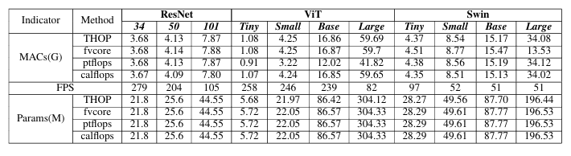

# Is Attention All You Need: A Survey about the Efficiency of ViT and Swin Transformer -- CityU GE2340 Project 24/25 semA

## Introduction

We are from CityU GE2340 AI: Past, Present, & Future Group 32. This repository contains some of the code used in our project. We have gathered various libraries that compute the network's MACs and Params, and we found a [method](https://blog.csdn.net/rayso9898/article/details/130006580) for calculating the inference speed of the network.

We would like to thank [**THOP**](https://github.com/ultralytics/thop), [**fvcore**](https://github.com/facebookresearch/fvcore), [**ptflops**](https://github.com/sovrasov/flops-counter.pytorch), and [**calflops**](https://github.com/MrYxJ/calculate-flops.pytorch) for their contributions. This repository is just a collection.

## Environment

### Packages Used:
- Python 3.8
- CUDA 11.8
- PyTorch 2.0.0
- timm 1.0.11
- numpy
- tqdm
- Pillow

## Usage

### Method to Calculate MACs and Params Using Existing Libraries:
```shell
python flops.py
```

### Method to Manually Calculate Model Inference Speed (FPS):
```shell
python cal_time.py
```

## Result
Some of our tests on an RTX 3090 are shown in the figure below: 

## For evaluators
For the evaluators of this project, the PMD_split dataset can be obtained from [PMD](https://jiaying.link/cvpr2020-pgd/). Although they have not released the training code, we implemented the training code based on the descriptions in their paper. We also wrote a dataloader according to the dataset structure. Training can be done with:
```shell
python train_pmd.py
```

Inference can be carried out using the official implementation found at [PMD Official Implementation](https://jiaying.link/cvpr2020-pgd/) if needed.

The dataset for AIGC Detection uses the CS4487 Machine Learning 24/25 semA Project. We do not have the rights to distribute this dataset. Training can be done with:
```shell
python train_AIGC.py
```

## Acknowledgement
Once again, we would like to thank [**THOP**](https://github.com/ultralytics/thop), [**fvcore**](https://github.com/facebookresearch/fvcore), [**ptflops**](https://github.com/sovrasov/flops-counter.pytorch), [**calflops**](https://github.com/MrYxJ/calculate-flops.pytorch), and [**fvcore**](https://jiaying.link/cvpr2020-pgd/) for their contributions to the open-source community.
